### Geração Procedural de Texturas com Coherent Noise

1 - Mapas "vizinhos":

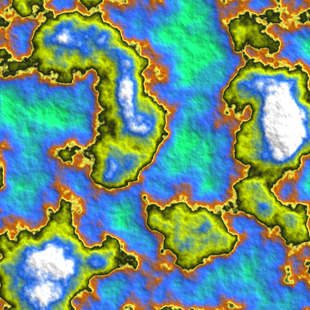
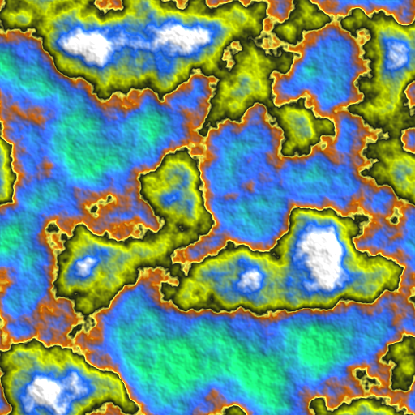

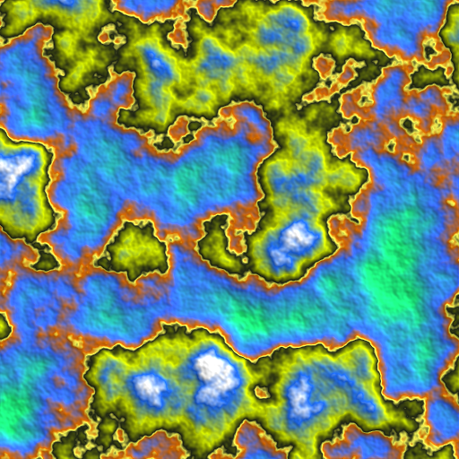
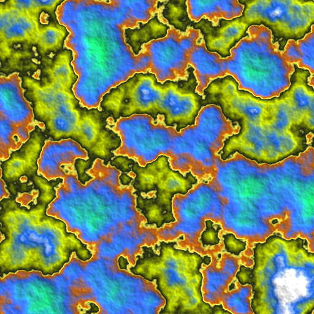

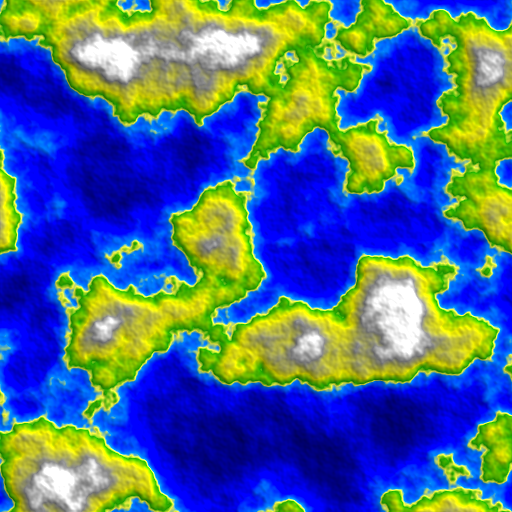

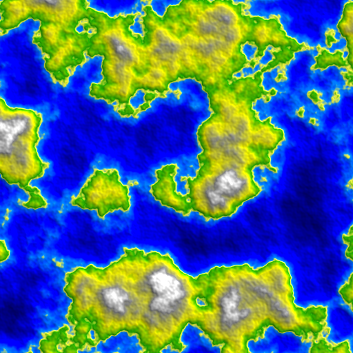
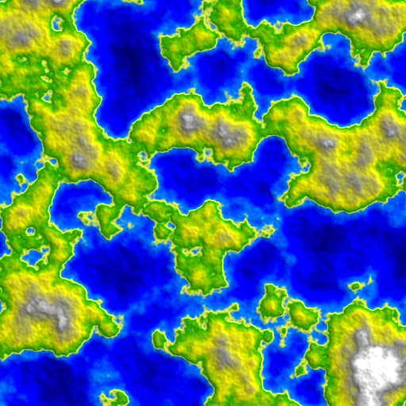

2 - Explorando diferentes números de oitavas, frequência e persistência:

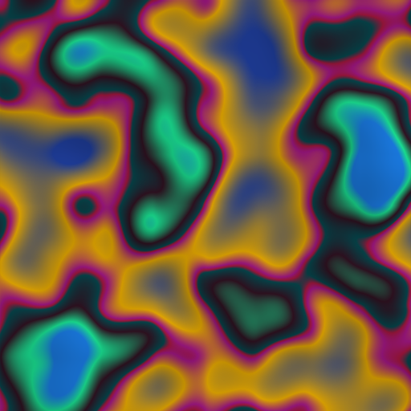

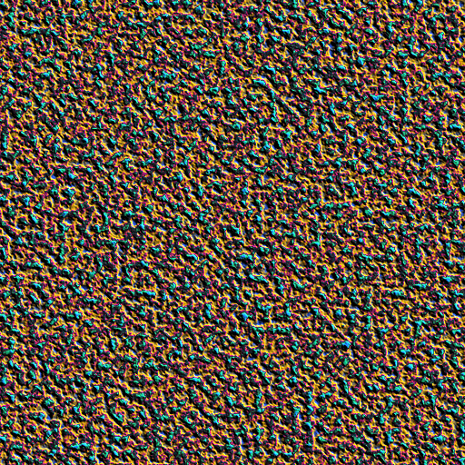

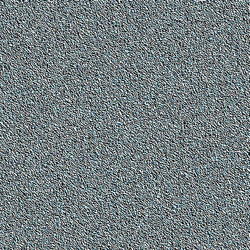

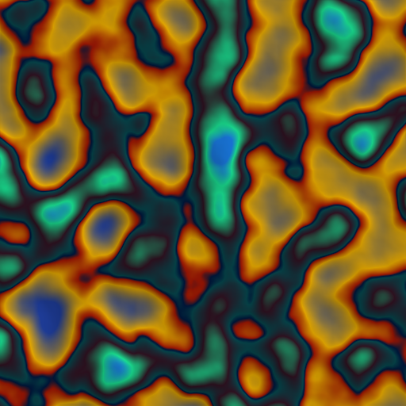

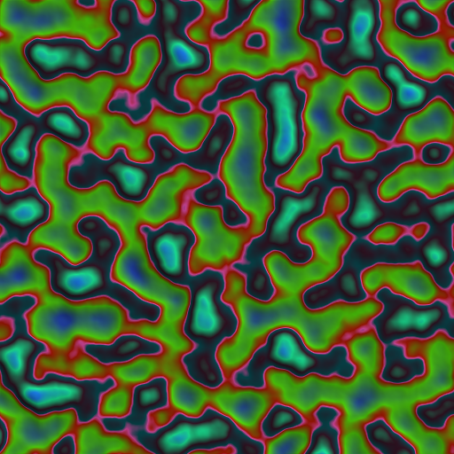

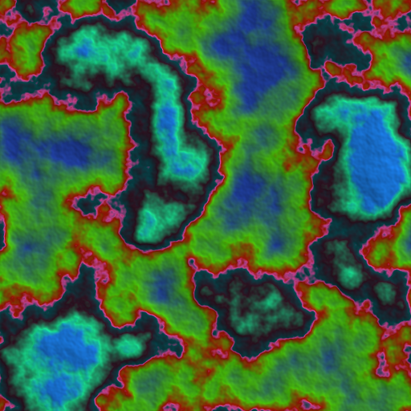

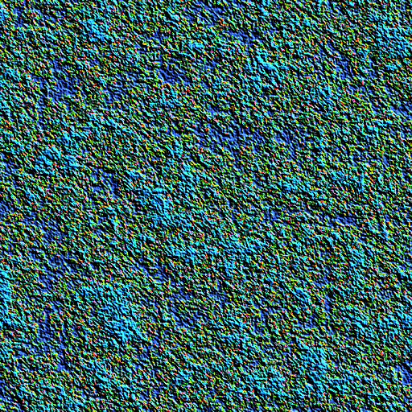

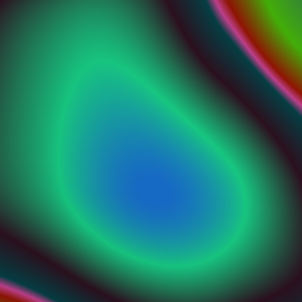

3 - Mapeamentos de biomas (Gradientes):

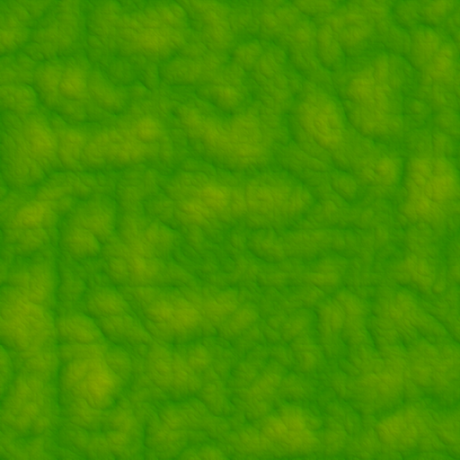

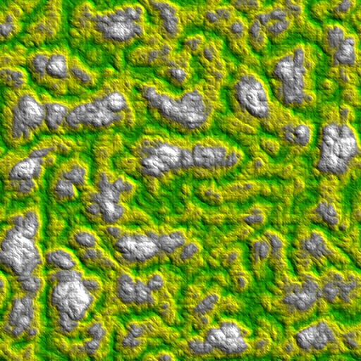
